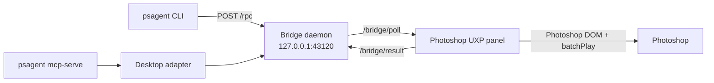

PSAgent Bridge is a local automation stack for Photoshop. It gives agents and humans a stable command surface, operation payload schema, and runtime bridge between CLI workflows and Photoshop UXP APIs.

## Components

- `psagent` CLI: user-facing command surface for sessions, documents, layers, operations, render, checkpoints, and diagnostics.
- Bridge daemon (`psagent bridge daemon`): local HTTP process that brokers RPC calls between CLI and the connected UXP panel.
- UXP panel plugin (`photoshop-uxp-bridge/`): executes operations inside Photoshop and reports structured results.
- MCP server (`psagent mcp-serve`): exposes a focused tool set for agent clients.
- Integration tests (`tests/integration`): exercise end-to-end CLI -> adapter -> bridge path.

## Runtime architecture

## What this stack is optimized for

- Agent-oriented operation execution with refs, per-op error policy, and rollback options.
- Reproducible CLI workflows for local development and integration testing.
- Programmatic document and layer operations in real Photoshop.

## What is intentionally scaffolded

- Cloud mode is a stub adapter that validates configuration and returns scaffold responses.
- Some Photoshop actions still rely on Action Manager descriptors and vary by host state/version.

Continue with [quickstart](/quickstart) for first-run setup.
